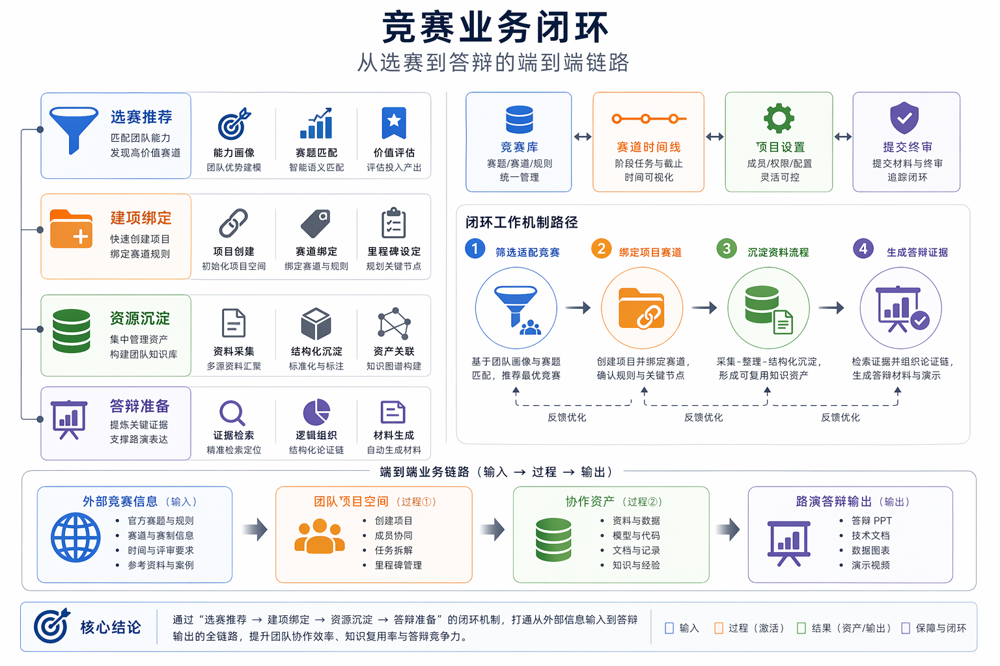
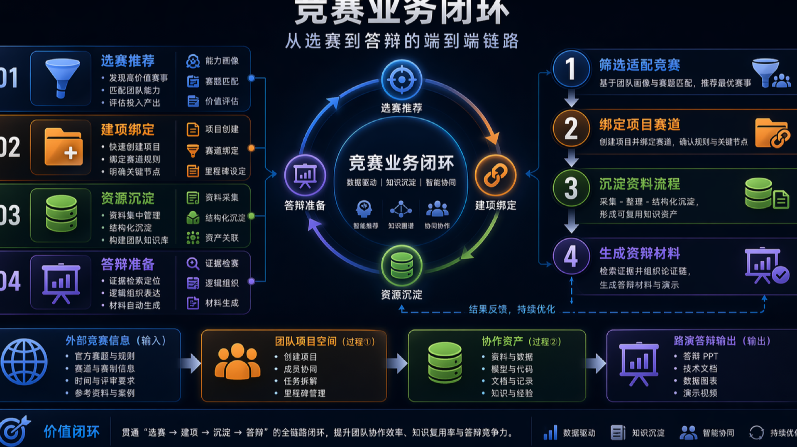

# 系统总体技术白皮书

> 本文档面向比赛技术评审、路演答辩和项目归档，内容基于当前仓库实现与已有文档整理。

## 定位

WinLoop AI（赛帮帮）是一套面向竞赛团队的项目工作台，主链路是“选赛 -> 建项 -> 沉淀项目资源 -> 协作梳理 -> 提交与答辩准备”。当前实现已经围绕 Team、Project、ProjectResource、AI Runtime、知识索引和答辩工作台形成平台化架构，而不是单点聊天助手。

## 核心对象

系统以 Team 作为协作、权限、席位和 AI credits 的边界；以 Project 作为工作推进主对象；以 ProjectResource 统一承载上传资料、协作文档、流程画布和自由画布；以 ProjectOutline、Loopy Data 和 AI 会话作为派生视图与智能执行层。

## 技术栈

前端采用 Nuxt / Vue / Pinia / UnoCSS，服务端走 Nitro API 与 TypeScript 服务层，主要持久化依赖 PostgreSQL，运行配置和部分运行态能力预留 Redis。AI 能力通过平台级 channel 和 provider 配置解析，不把模型参数散落到具体页面。

## 比赛表达

在比赛材料中，建议把 WinLoop 描述为“竞赛团队的智能作战工作台”：它把资料、协作、知识推理、流程编排和答辩复盘连接为同一套可追踪系统。

## 配套图

PPT 版：

PPT 版：

## 代码与文档依据

- `README.md`
- `docs/workspace-information-architecture.md`
- `package.json`
