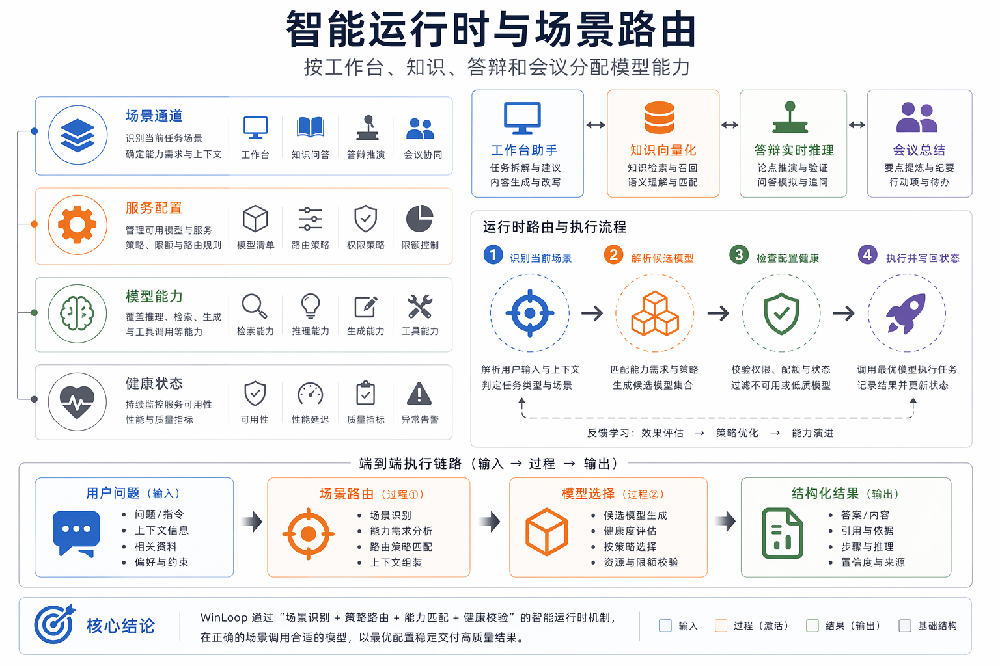
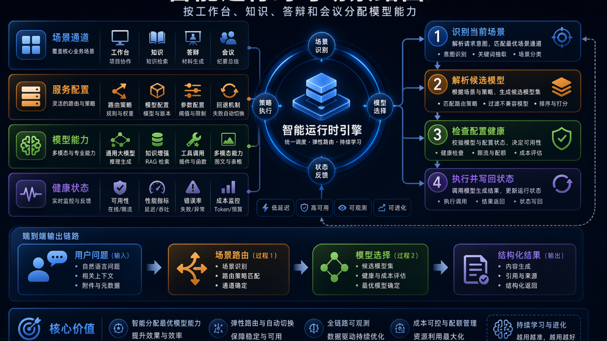
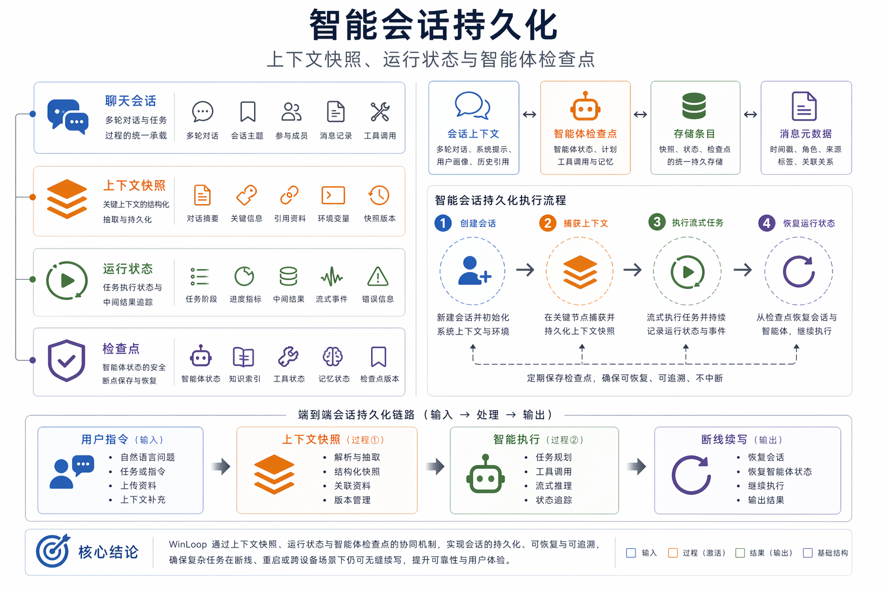
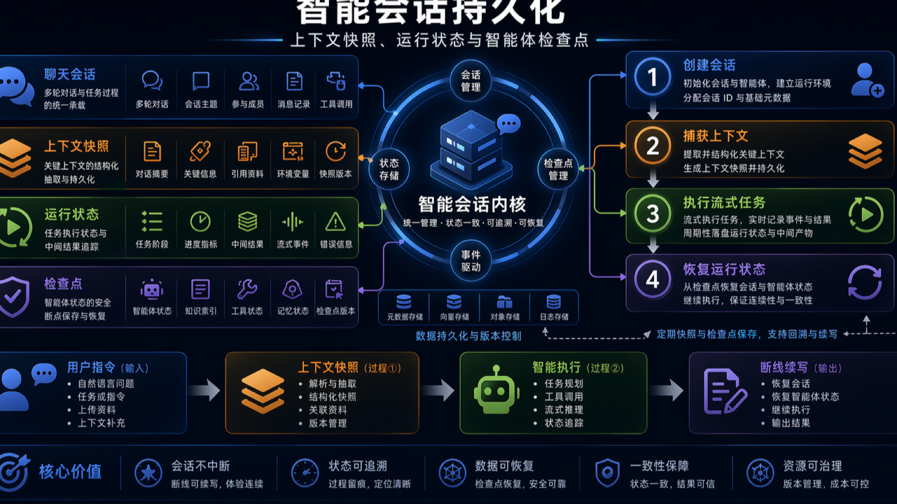

# AI 内核与运行时技术文档

> 本文档面向比赛技术评审、路演答辩和项目归档，内容基于当前仓库实现与已有文档整理。

## 设计目标

AI 层的目标不是提供一个全局聊天入口，而是在不同工作场景下提供可配置、可观测、可恢复的智能能力。工作台问答、文档补齐、知识 embedding、视觉投影、答辩 realtime、会议总结和智能工作流都通过明确 channel 表达。

## 场景路由

运行时通过 platform AI channel 解析当前场景的 provider、model、capability 和健康状态。这样可以避免未配置模型时静默回退，也能把 degraded、writeBlocked、rebuildRecommended 等状态直接暴露给前端。

## 会话连续性

AI 会话持久化不仅保存消息，还保存 contextSnapshot、runState、DeepAgent checkpoint 与 store item。刷新或断线后，项目页可以恢复上下文与运行状态，避免 AI 任务变成一次性不可追踪调用。

## 工程边界

只读链路可以降级提示，写链路必须显式失败或进入审批；progress/tool 等审计消息应与模型上下文分层，避免把系统事件重新喂给模型。

## 配套图

PPT 版：

PPT 版：

## 代码与文档依据

- `server/utils/ai-runtime.ts`
- `server/utils/platform-ai-channels.ts`
- `scripts/migrations/2026-04-21-ai-session-persistence.sql`
