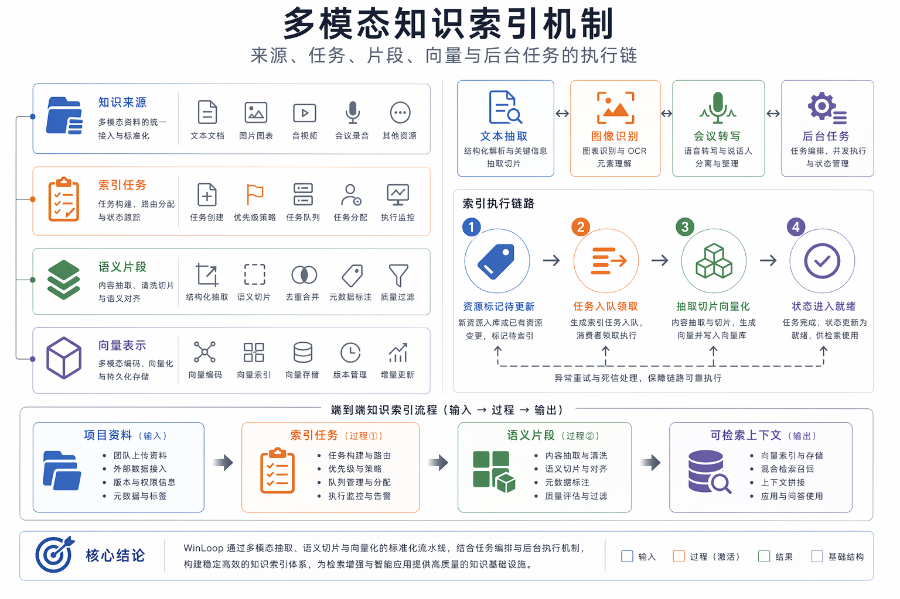
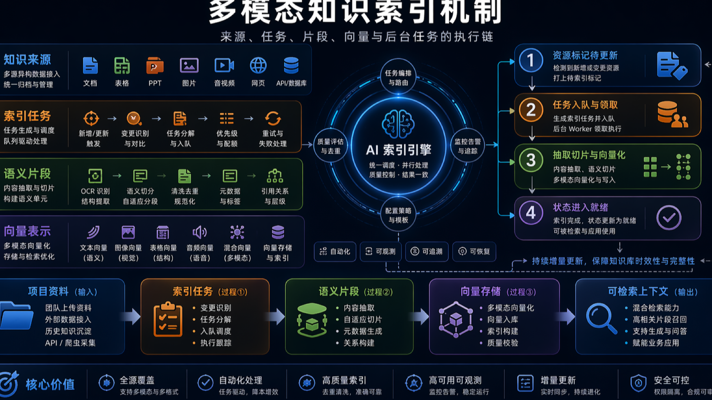
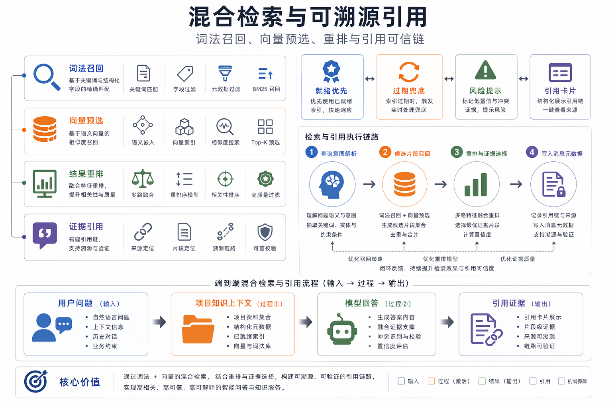
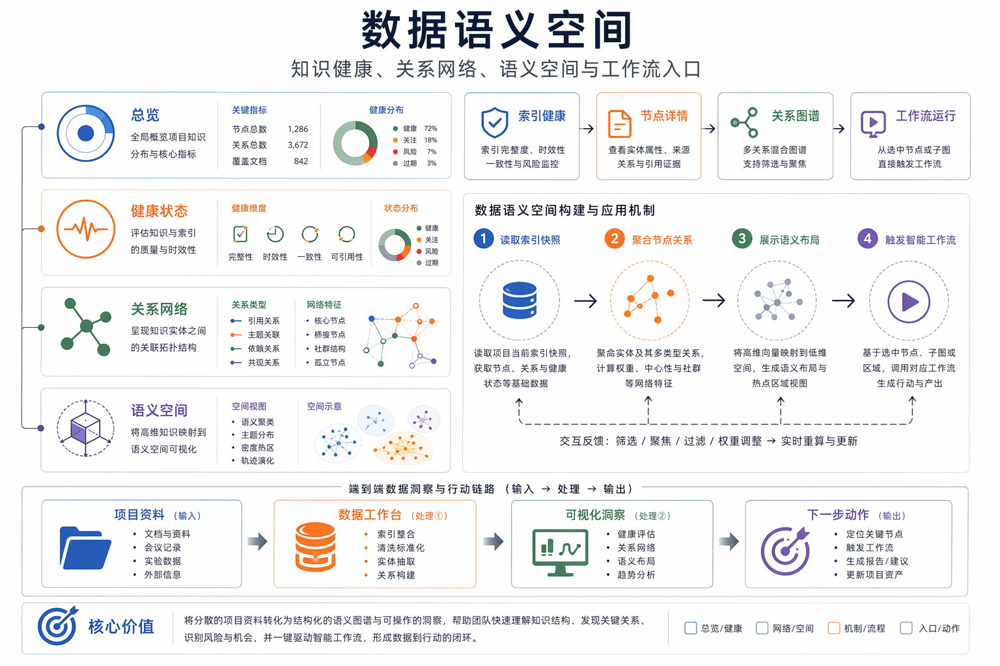

# 多模态知识索引与可信引用技术文档

> 本文档面向比赛技术评审、路演答辩和项目归档，内容基于当前仓库实现与已有文档整理。

## 目标

项目知识索引把上传资料、协作文档、文档预览、图片/OCR、会议纪要和转写统一转换为可检索的知识片段，服务工作台 AI、项目聊天、画布 AI 和答辩上下文。

## 索引模型

当前索引底座包含 project_knowledge_sources、project_knowledge_index_tasks 和 project_knowledge_chunks。source 是 UI 真相源，task 是 worker 调度真相源，chunk 是检索与引用真相源。

## 多模态投影

V1 采用文本投影优先策略，不新建第二套向量表。图片摘要、OCR、会议纪要、会议转写和 Draw 摘要都被投影到统一文本 embedding 空间，降低系统复杂度。

## 可信引用

检索链路结合词法召回、向量预选、rerank、ready 优先和 stale fallback。AI 输出时把 citations、warning、usedFallback 写入 metadata，并由 WorkspaceAssistantMessageContent 渲染成可见引用卡片。

## Loopy Data

Loopy Data 将知识健康、关系网络、语义空间、节点详情和智能工作流集中到一个数据工作台，避免索引能力散落在项目设置页。

## 配套图

PPT 版：

PPT 版：

PPT 版：

## 代码与文档依据

- `docs/project-knowledge-rag-progress.md`
- `server/utils/project-knowledge-store.ts`
- `server/services/knowledge-vision.ts`
