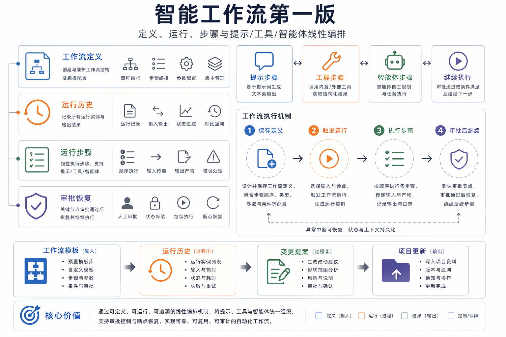
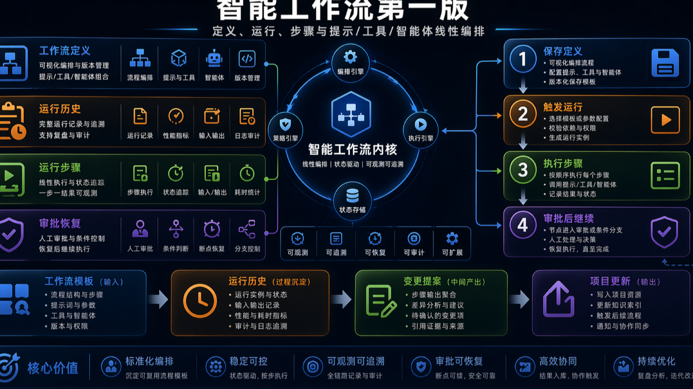

# Intelligence Workflow v1 技术文档

> 本文档面向比赛技术评审、路演答辩和项目归档，内容基于当前仓库实现与已有文档整理。

## 目标

Intelligence Workflow v1 在项目工作台内提供可重复运行的智能主链，支持保存 workflow 定义、执行线性 prompt/tool/agent 步骤、记录 run 与 step 历史，并在写操作需要审核时暂停。

## 数据模型

当前采用 ai_workflow_definitions、ai_workflow_runs、ai_workflow_run_steps 三层持久化。definition_json 保存 trigger、contextSources、toolAllowlist 与 steps；run 保存触发信息与 definition snapshot；run step 保存状态、输入、输出和 review context。

## 执行边界

V1 刻意保持线性，不做 DAG、条件分支编辑器或 cron。agent step 复用 executeWorkspaceAi，tool step 先走内置 registry 与 provider bridge，避免过早引入过宽 DSL。

## 审批恢复

项目写操作继续复用 ai_project_change_requests。关联提案 pending 时 run 进入 needs_review；提案批准后调用 continue；任一提案被拒绝则 run 失败，不做隐式跳过。

## 配套图

PPT 版：

## 代码与文档依据

- `docs/intelligence-workflow-v1.md`
- `server/services/ai/intelligence-workflow-engine.ts`
- `scripts/migrations/2026-04-22-intelligence-workflow-v1.sql`
