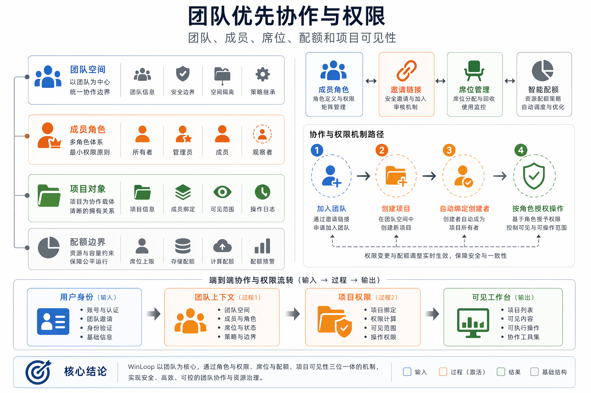
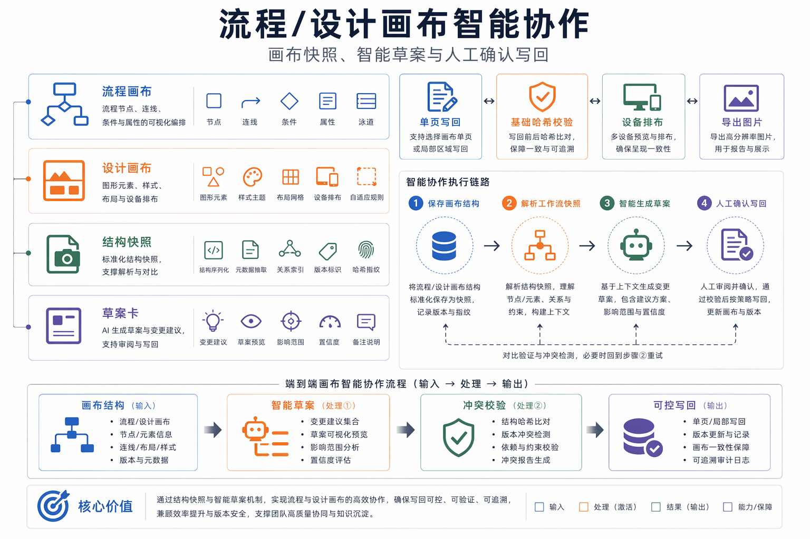
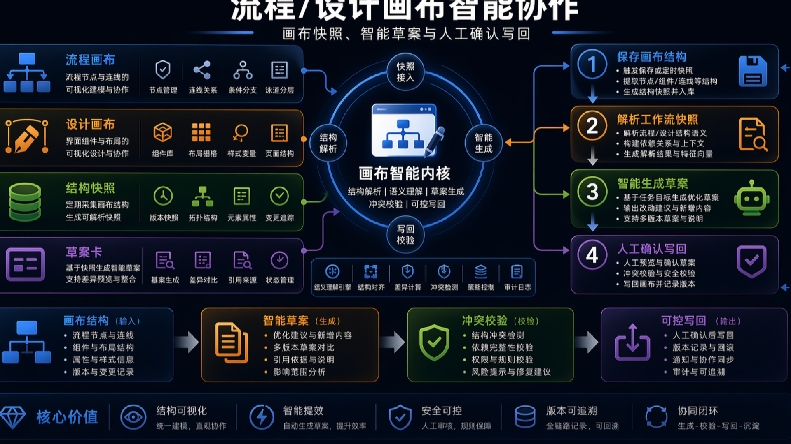

# 工作台协作与资源模型技术文档

> 本文档面向比赛技术评审、路演答辩和项目归档，内容基于当前仓库实现与已有文档整理。

## Team-First

Team 是成员、席位、邀请、权限和 AI 配额边界。项目创建、项目可见性、邀请加入和成员管理都应回到当前 Team 上下文，而不是隐式个人空间或旧 workspace-first 路径。

## 统一资源模型

ProjectResource 是项目内一等资料对象。binary 表示上传资料或系统资源库引用，markdown + notes 表示协作文档，draw + workflow 表示项目唯一流程画布，draw + freeform 表示自由画布。

## 协作入口

固定 flow tab 与资源列表中的 workflow 资源指向同一底层对象。协作文档支持 AI 上下文补齐，画布类资源可进入 draw.io 或 CanvasKit Host，并继续复用资源预览、下载、分享和索引链路。

## 画布 AI 安全边界

流程画布通过 autosave/save 回传 XML 并解析为 workflowSnapshot。AI 生成、补全、续改或调样式时先生成草案卡，再由用户手动 apply；baseWorkflowHash 用于阻止旧草案覆盖用户新修改。

## 配套图

PPT 版：

PPT 版：

PPT 版：

## 代码与文档依据

- `docs/workspace-information-architecture.md`
- `docs/collab-resource-model.md`
- `server/api/projects/[id]/resources/collab.post.ts`
