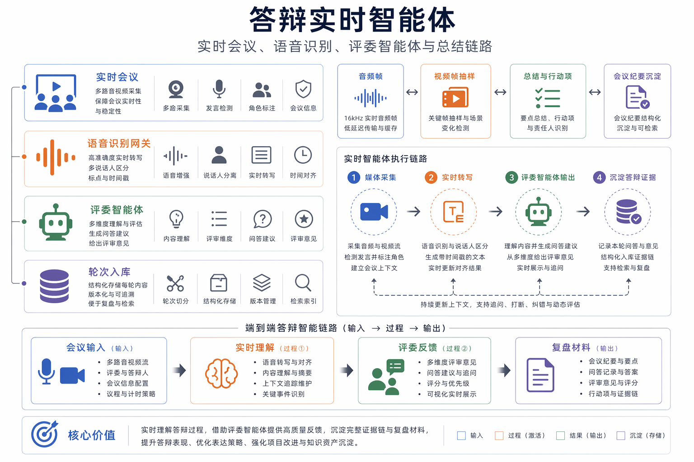

# 答辩与会议实时智能技术文档

> 本文档面向比赛技术评审、路演答辩和项目归档，内容基于当前仓库实现与已有文档整理。

## 目标

答辩能力把项目会议、实时音视频、ASR、评委 persona、智能追问、turn 入库和会后总结连接成一条链路，用于模拟答辩、沉淀证据和改进路演材料。

## 会议链路

站内 Web 客户端以 LiveKit 为真实媒体实现。成员端支持入会、麦克风、摄像头、屏幕共享；guest 分享页复用同一客户端但权限更收敛。

## ASR 与会后产物

Web 客户端上传 PCM 音频帧，服务端转发给 ASR gateway。会议结束后由 transcript_finalize、meeting_summary、recording_finalize 后台任务沉淀会议纪要资源和录制资源。

## 答辩 realtime

答辩 sidecar 保留 LiveKit 会议壳，不把 Qwen/Coze 改成 RTC provider。Qwen 通过服务端 relay 解决浏览器鉴权头问题，Coze 作为正式依赖按需动态导入。

## 配套图

PPT 版：

## 代码与文档依据

- `docs/workspace-defense-workbench-progress.md`
- `docs/meeting-runtime-setup.md`
- `server/services/meeting/project-meeting.ts`
