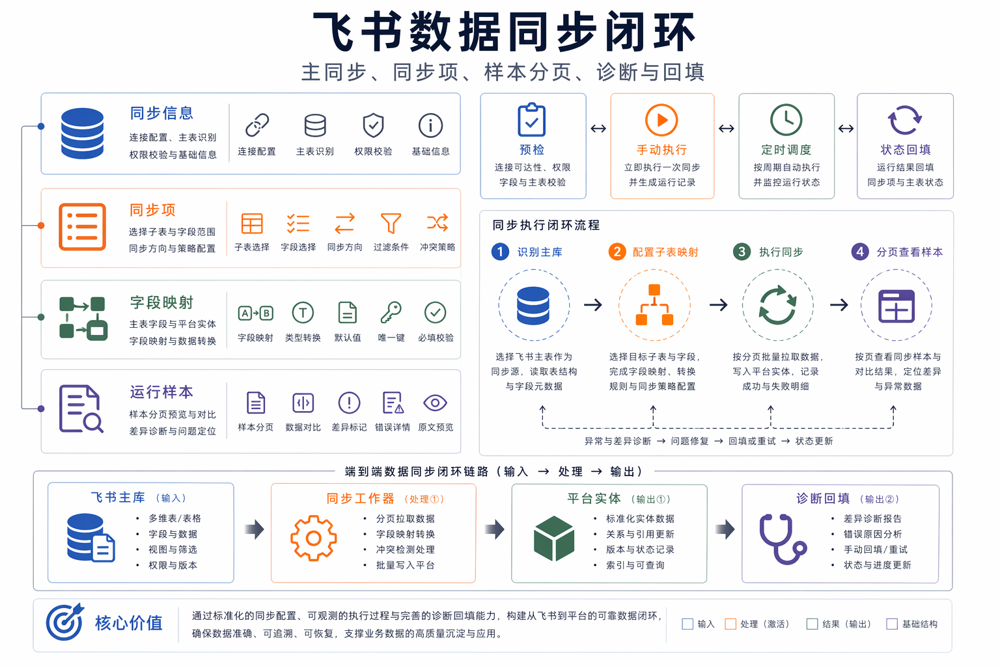
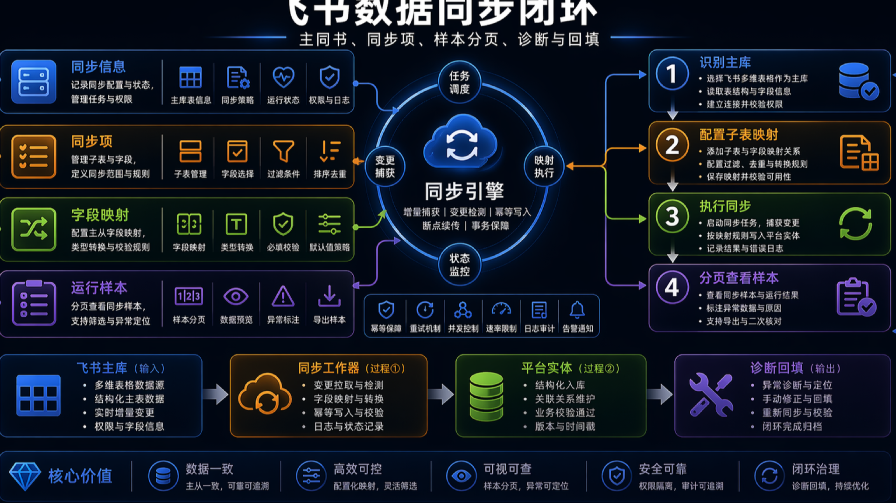

# 数据集成与后台运营技术文档

> 本文档面向比赛技术评审、路演答辩和项目归档，内容基于当前仓库实现与已有文档整理。

## 飞书同步模型

飞书多维同步分为“同步信息”和“同步项”。同步信息对应一个主库 appToken，并承担调度边界；同步项描述子表如何同步到 contest、track 或 resource 等平台实体。

## 诊断能力

预检会使用当前 Drawer 中尚未保存的草稿配置，方便管理员调整映射后立即确认结果。运行样本落库后支持分页查看，避免把固定 preview 上限误解为真实同步上限。

## 后台配置

管理员入口覆盖飞书集成、AI provider、会议 provider、资源 worker、通知、运营报表和发布队列等能力。后台配置应成为业务运行时真相源，敏感字段通过配置主密钥加密。

## 通知边界

平台通知、比赛临近提醒和成员变动适合进入通知中心；项目内部 activity feed 不应混入平台通知，避免用户把协作过程噪声误判为系统级事件。

## 配套图

PPT 版：

## 代码与文档依据

- `docs/feishu-bitable-sync-guide.md`
- `server/services/feishu/bitable-sync.ts`
- `server/utils/notification-store.ts`
