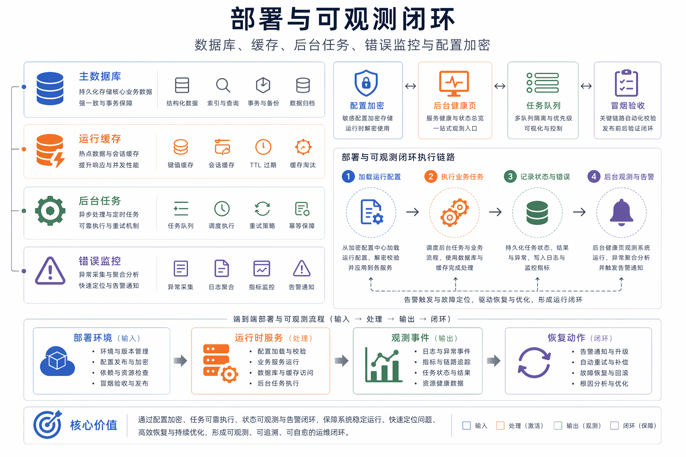
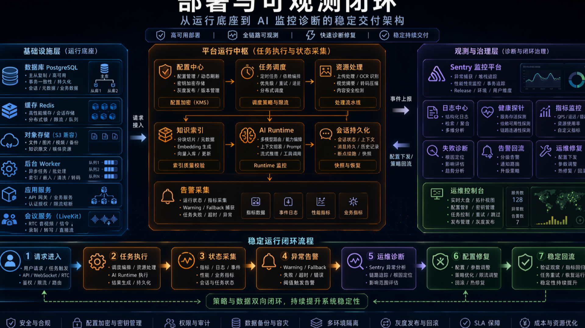

# 部署、安全与可观测性技术文档

> 本文档面向比赛技术评审、路演答辩和项目归档，内容基于当前仓库实现与已有文档整理。

## 基础依赖

运行时至少需要 PostgreSQL、Redis 和 WINLOOP_CONFIG_MASTER_KEY。PostgreSQL 是核心业务持久化依赖；Redis 主要用于运行时配置和预留能力；配置主密钥负责后台 secret 加密。

## 部署链路

仓库提供 Dockerfile、Jenkins 部署配置、1Panel webhook 示例和 smoke 脚本。开发态要求显式 WINLOOP_DEV_HOST / WINLOOP_DEV_PORT，避免静默回退造成环境误判。

## worker 可观测

知识索引 worker、资源预览 worker、资源回收 worker、会议后处理任务和导出任务都应以后台状态页和 recent runs 证明链路可运行、可诊断。

## Sentry 与 smoke

Sentry 是可选能力。staging 可通过 /api/admin/sentry/smoke 对 Nitro 与 worker 两类上报路径做验证，响应头和 traceId 用于证明链路可观测。

## 配套图

PPT 版：

## 代码与文档依据

- `README.md`
- `server/api/admin/sentry/smoke.post.ts`
- `deploy/jenkins/README.zh-CN.md`
