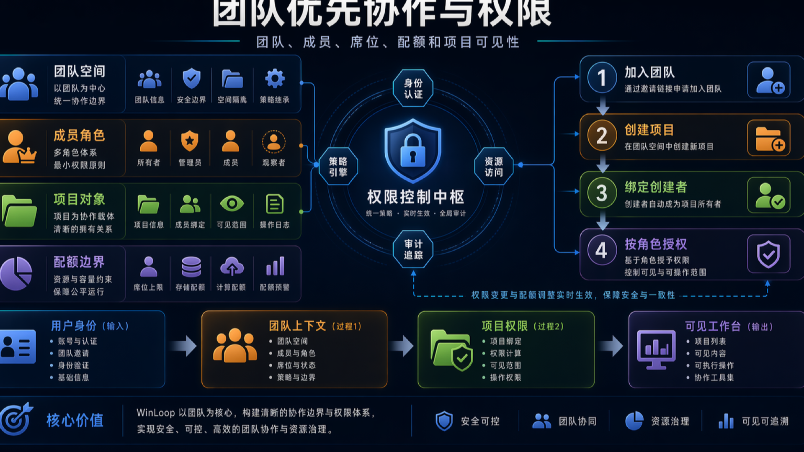
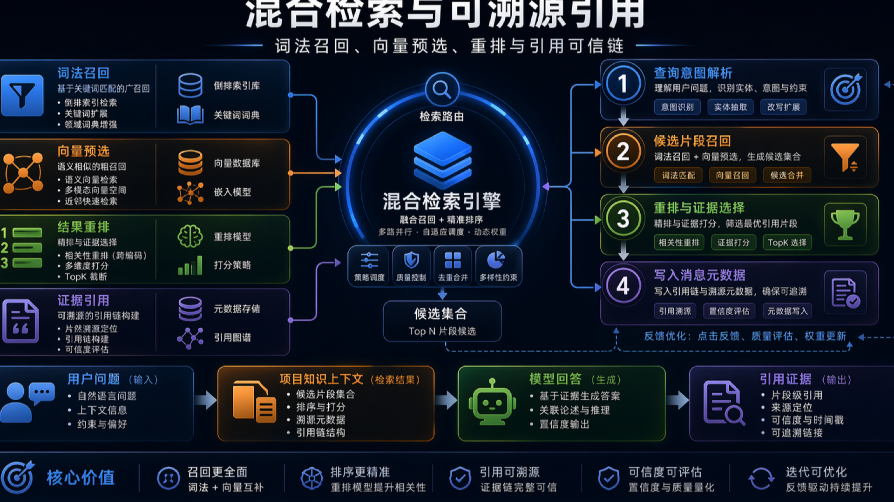
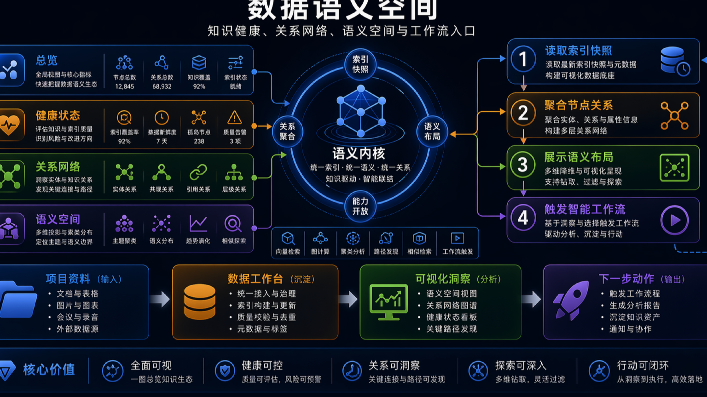
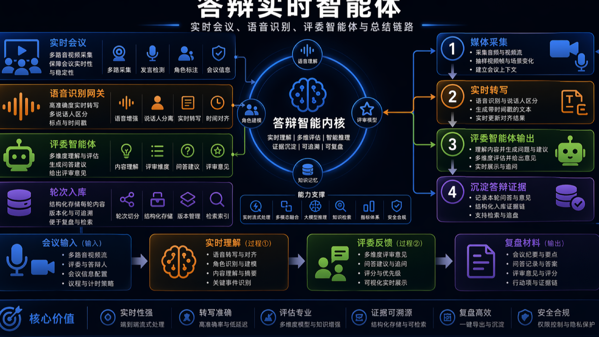

# WinLoop 比赛答辩逐页讲稿

> 适用场景：8-10 分钟技术答辩、路演决赛、项目路演复盘。默认假设使用当前资料包中的 PPT 图作为演示主图，不额外制作动画页。

## 使用说明

本讲稿采用“页面目标 + 主图 + 讲稿正文 + 评委可能追问”结构，方便直接排练。若需要压缩到 5 分钟，可优先保留第 1、2、4、5、7、9、11 页；若有 12 分钟以上，则可在第 8 页和第 10 页适当展开工程细节。

## 全场节奏建议

- `0:00-0:40`：先把项目定位讲清楚，不先陷入技术细节。
- `0:40-2:00`：用业务闭环与工作台结构说明为什么这个产品真实存在需求。
- `2:00-5:30`：重点讲 AI 运行时、可信引用、DeepAgent、实时答辩四个技术壁垒。
- `5:30-7:30`：讲工程可落地性，包括协作模型、部署、观测与治理。
- `7:30-9:00`：收束为差异化价值、竞赛场景适配和后续扩展。

## 第 1 页 封面与一句话定位

- 主图：无，封面页即可。
- 标题建议：`WinLoop AI：竞赛团队的智能作战工作台`
- 核心目标：让评委在 20 秒内知道这不是泛化 AI 聊天产品。

讲稿：

各位评委老师好，我们带来的项目叫 WinLoop AI。我们把它定义为“竞赛团队的智能作战工作台”。它不是一个额外加了聊天框的项目管理工具，而是一套把选赛、建项、资料沉淀、多人协作、知识推理、流程编排和答辩演练连接起来的工作平台。我们今天会重点展示三件事：第一，为什么它符合竞赛团队的真实工作方式；第二，为什么它的 AI 不是表层接壳；第三，为什么它已经具备可运行、可治理、可扩展的工程基础。

评委可能追问：

- 问：一句话跟现有协作平台有什么不同？
- 答：现有平台更像“通用协作容器”，WinLoop 更像“围绕竞赛全过程定制的智能作战系统”，核心对象、AI 路由和答辩链路都是按竞赛场景设计的。

## 第 2 页 竞赛场景痛点与业务闭环

- 主图：
- 核心目标：说明场景真实，不是先有 AI 再找问题。

讲稿：

竞赛团队在真实推进过程中，经常会遇到三个问题。第一，信息分散，选赛信息、赛题要求、项目资料、会议纪要和流程设计散落在不同工具里。第二，协作割裂，文档、设计、流程、答辩准备彼此脱节，难以形成闭环。第三，答辩准备高度依赖临时整理，团队很难在冲刺阶段快速形成高质量、可追溯、可复用的表达材料。WinLoop 把这条链路收敛为一个完整闭环：从选赛、建项、资源沉淀，到协作梳理，再到答辩演练与总结沉淀。这样做的意义在于，AI 不再是一个外挂，而是嵌入在整个项目推进链路之中。

评委可能追问：

- 问：为什么一定要做成闭环？
- 答：因为竞赛不是单次写作任务，真正困难的是跨阶段的信息连续性和团队协同。闭环结构决定了 AI 能否真正复用前序上下文。

## 第 3 页 产品结构与工作台主对象

- 主图：
- 核心目标：把 Team、Project、ProjectResource 三个核心对象讲清楚。

讲稿：

在产品结构上，WinLoop 不是围绕“频道”或者“聊天”组织，而是围绕 Team、Project 和 ProjectResource 组织。Team 负责协作边界、权限、席位与 AI credits；Project 是团队推进比赛项目的主对象；ProjectResource 统一承载上传资料、协作文档、流程画布和设计画布。这个对象模型非常关键，因为它决定了后面的知识索引、流程编排、AI 路由和答辩辅助都有稳定依附对象，而不是临时把数据塞进模型上下文里。

评委可能追问：

- 问：这样设计的核心好处是什么？
- 答：对象模型稳定以后，资源权限、知识索引、协作状态和 AI 运行时都能对齐到同一语义边界，后续扩展成本更低。

## 第 4 页 团队优先协作与统一资源模型

- 主图：
- 补充图：
- 核心目标：展示系统不是单用户 AI 工具，而是团队协作平台。

讲稿：

WinLoop 的协作模型是 Team-First，也就是先定义团队、成员、席位与可见性，再承载项目。项目内所有资料先统一收敛成 ProjectResource，然后再通过 `resourceKind` 和 `collabPurpose` 区分它是上传资料、协作文档、流程画布还是自由画布。这样做有两个价值。第一，所有资源后续都可以接入权限、索引、评论、分享和 AI 上下文。第二，团队协作不需要在多个系统里重新建模，平台天然支持“项目推进”和“材料沉淀”同步发生。

评委可能追问：

- 问：为什么资源模型要统一？
- 答：如果文档、流程图、设计图、会议纪要是四套独立模型，后面的引用、检索、评论和 AI 编排就很难复用，统一资源模型是后续智能能力的底座。

## 第 5 页 AI 运行时与多模型治理

- 主图：
- 核心目标：证明 AI 不是“一个模型处理一切”。

讲稿：

很多项目的 AI 实现方式是把一个大模型接到所有入口上，但我们没有这么做。WinLoop 先定义 channel，再按场景去选择 provider 和模型能力。比如工作台问答、知识 embedding、视觉投影、实时答辩和工作流执行，对模型的输入形态、实时性要求、稳定性要求都不同。平台会根据 channel、能力匹配、成本、权限、fallback 和健康状态去动态选择运行时。这就意味着，AI 在这里是一个可治理的系统，不是单点调用。评委如果只记住一句话，可以记住这一句：我们做的是场景化智能运行时，而不是统一聊天入口。

评委可能追问：

- 问：多模型治理的实际意义是什么？
- 答：实际意义就是可用性和成本可控。不同场景可以用不同模型，某个 provider 异常也不会拖垮整个平台。

## 第 6 页 可信引用与项目知识增强

- 主图：
- 补充图：
- 核心目标：回答“为什么 AI 输出可信”。

讲稿：

WinLoop 的知识增强链路强调的不是“检索得多”，而是“结论必须带证据”。项目资源先经过抽取、分块、embedding，再通过词法召回、向量预选和 rerank 生成项目知识上下文。回答时不只返回正文，还会返回 citation、warning 和 fallback 标记，并在前端直接渲染成引用卡片。这意味着 AI 回答不是黑盒猜测，而是带有来源和风险边界的结构化输出。对比赛答辩来说，这一点非常重要，因为评委最担心的就是 AI 在正式场景里一本正经地编造结论。

评委可能追问：

- 问：如果知识库没索引完怎么办？
- 答：系统会显式暴露 warning 和 fallback，而不是悄悄装作一切正常。这是我们特别强调的可治理设计。

## 第 7 页 DeepAgent 与长任务可恢复执行

- 主图：
- 补充图：
- 核心目标：把“AI 能持续工作”讲清楚。

讲稿：

竞赛项目里大量任务都不是一次性回答能完成的，例如资料梳理、流程生成、会后总结和写操作提案。为了解决这个问题，我们引入了可恢复执行机制。系统会保存 contextSnapshot、runState、thread binding 和 checkpoint；当任务命中写操作审核门时，流程暂停，待人工确认后再继续执行。这和普通聊天工具最大的区别在于，任务的状态可追踪、可恢复、可审计。对团队真实协作来说，这比“模型一口气说很多话”更重要。

评委可能追问：

- 问：为什么要加人工审核门？
- 答：因为竞赛材料和项目资源具有真实后果，写链路必须可控。我们宁可显式暂停，也不让模型直接覆盖用户成果。

## 第 8 页 多模态语义空间与数据工作台

- 主图：
- 补充图：
- 核心目标：说明多模态不是噱头，而是统一空间设计。

讲稿：

项目资料并不只有文本，还有图片、OCR、会议转写、流程图快照和网页抓取。我们的做法不是为每种模态都建一套孤立系统，而是采用文本投影优先策略，把多模态内容转换成统一文本语义表示，再进入同一个 embedding 空间。Loopy Data 则把知识健康、关系网络、语义布局和工作流入口集中展示出来。这样评委看到的不是“我们支持多模态”这句口号，而是一套能解释、能调试、能运营的统一语义空间。

评委可能追问：

- 问：为什么没有单独做图像向量库？
- 答：当前阶段我们优先选择可解释性与工程复杂度平衡。统一空间更利于快速落地和治理，后续可以在此基础上继续扩展。

## 第 9 页 实时答辩智能体

- 主图：
- 补充图：
- 核心目标：形成最强演示记忆点。

讲稿：

答辩是竞赛场景最关键的时刻，所以我们没有把它做成一个简单问答页，而是做成了基于真实会议链路的实时智能体。LiveKit 负责音视频房间，ASR 负责转写，Qwen/Coze realtime 负责实时推理，turn 管理、摘要和答辩建议则回流到工作台。我们特别强调一点：答辩 AI 并不替代会议系统，而是附着在真实 RTC 链路上运行。这样它才能真正理解“谁在说话、当前在展示什么、会后要沉淀什么”，而不是脱离场景空转。

评委可能追问：

- 问：实时链路会不会很脆弱？
- 答：所以我们保留会议壳、relay 和服务端治理，不把所有实时能力压在浏览器端裸调用模型上。

## 第 10 页 部署、观测与治理

- 主图：
- 补充图：
- 核心目标：证明项目不是演示级原型。

讲稿：

平台级 AI 最终比拼的是运维能力。WinLoop 当前已经把 PostgreSQL、Redis、Worker、资源处理、知识索引、AI Runtime、Sentry 和后台诊断收敛到一个完整的运行闭环里。我们不仅关心模型能否给出答案，还关心 provider 探测、channel 测试、embedding 校验、worker backlog、recent failures 和 fallback warning 是否都能被观测和修复。换句话说，我们并不是只做一个“能跑一次”的 demo，而是在搭建一套可以持续运行、持续优化的智能平台。

评委可能追问：

- 问：为什么观测治理要放进比赛答辩？
- 答：因为真正有工程价值的 AI 平台，必须具备稳定运行和异常治理能力。否则它只能算炫技，而不是产品能力。

## 第 11 页 差异化与技术壁垒

- 主图：可复用前几页缩略图组合，或直接口述。
- 核心目标：做总结，不再引入新概念。

讲稿：

WinLoop 的差异化主要有四个层次。第一，它是围绕竞赛全过程设计的，不是通用协作软件加 AI。第二，它的 AI 是场景化运行时，有多模型治理、可信引用和实时答辩能力。第三，它具备统一资源模型和统一语义空间，能把协作、资料和智能执行真正连起来。第四，它已经考虑部署、观测、治理和恢复，不停留在表层演示。因此我们认为，这个项目既能展示产品理解，也能展示系统工程能力。

评委可能追问：

- 问：如果后面继续做，优先方向是什么？
- 答：优先是更深的答辩链路、引用后验校验、工作流扩展和更成熟的多模态理解。

## 第 12 页 收束与结束语

- 主图：封底页即可。
- 核心目标：把评委记忆点收束成一句话。

讲稿：

最后我们想用一句话总结 WinLoop：它不是把 AI 放进竞赛场景，而是把竞赛场景本身重构成一套可协作、可推理、可答辩、可治理的智能工作台。谢谢各位评委老师，欢迎提问。

## 加分问答库

### 问题 1：为什么你们强调可信引用？

因为竞赛答辩是高风险表达场景，AI 的结论如果没有证据链，现场越自信越危险。可信引用是技术能力，也是风险控制能力。

### 问题 2：为什么要做答辩实时链路？

因为答辩不是文档任务，而是实时互动场景。只有把会议链路、语音转写、追问建议和会后沉淀打通，AI 才真正进入业务主场。

### 问题 3：为什么不直接用现成协作平台？

现成平台很强，但它们不是围绕竞赛全过程设计的。WinLoop 的优势在于对象模型、AI 路由、知识链路和答辩链路都贴合竞赛场景。

### 问题 4：项目的工程价值体现在哪里？

体现在统一资源模型、可恢复执行、AI 观测治理和真实会议链路这四个部分。这些能力决定它能不能长期跑，而不是只在演示时跑通。
