# WinLoop 评委版技术白皮书（强化版）

> 本文档面向技术评审、决赛答辩和项目归档，重点不是描述功能清单，而是说明系统结构、工程判断与 AI 技术壁垒。

## 摘要

WinLoop AI 是一套面向竞赛团队的智能作战工作台。它围绕“选赛 - 建项 - 资料沉淀 - 协作梳理 - 答辩演练 - 会后沉淀”这一完整链路设计，不把 AI 理解为外接聊天能力，而是把 AI 作为平台中的场景化运行时、知识增强引擎、长任务执行器和实时答辩辅助层。

与普通项目管理工具或通用协作平台相比，WinLoop 的重点不在于再造一个任务面板，而在于围绕竞赛项目这一高压、高协作、高表达密度场景，建立一套统一的资源模型、语义空间与智能执行底座。与普通 AI 助手相比，WinLoop 的重点也不在于生成一段文本，而在于让结论可追溯、执行可恢复、实时链路可治理、运行状态可观测。

## 1. 业务背景与问题定义

竞赛团队的工作具有三种典型特征。第一，时间高度集中，项目往往在短周期内快速推进，信息积累与表达输出几乎同步发生。第二，资料形态复杂，不仅有文档和表格，还包括图片、网页、流程图、会议纪要、录制和答辩草稿。第三，最终交付高度依赖团队表达能力，特别是在终审答辩阶段，资料、逻辑、展示和即时应对需要同时到位。

传统工具链在这一场景中通常存在三类断裂。第一类是资源断裂，资料散落在聊天记录、云盘、文档系统和设计工具中。第二类是协作断裂，文档写作、流程设计、项目推进和答辩准备往往分属不同平台。第三类是智能断裂，AI 即使存在，也经常只能在某个页面进行临时问答，无法复用项目全局上下文。

WinLoop 的设计目标，就是消除这三类断裂。

## 2. 系统定位与总体架构

WinLoop 的核心定位不是“带 AI 的协作平台”，而是“竞赛团队的智能作战工作台”。系统的核心对象包括 Team、Project 和 ProjectResource。Team 提供协作、权限、席位和 credits 边界；Project 负责承载比赛项目主流程；ProjectResource 统一承载上传资料、协作文档、流程画布、自由画布与派生资源。

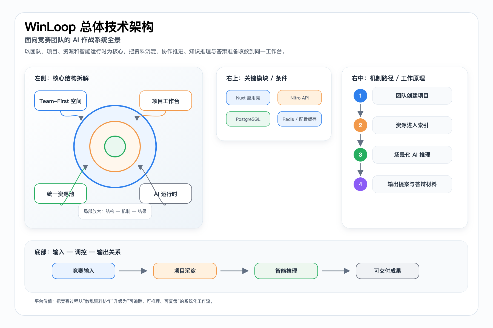

PPT 版：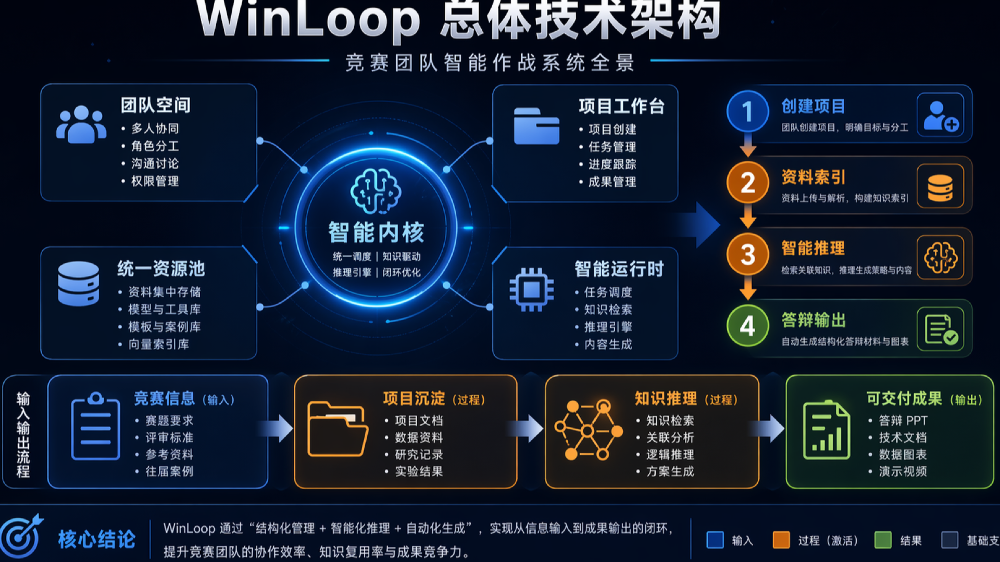

从技术分层上看，系统可以拆成五层：

- 体验层：项目工作台、右侧助手、设计画布、流程画布、Loopy Data、答辩工作台。
- 对象层：Team、Project、ProjectResource、ProjectOutline、会议会话、AI 会话。
- 智能层：AI Runtime、Project Knowledge、Intelligence Workflow、DeepAgent、Defense Realtime。
- 服务层：Nitro API、TypeScript 服务层、后台 Worker、ASR/RTC relay、Provider Bridge。
- 运行层：PostgreSQL、Redis、对象存储、Sentry、配置中心与运维后台。

## 3. Team-First 协作与统一资源模型

WinLoop 之所以能够承载后续 AI 能力，前提是数据模型足够稳定。系统采用 Team-First 协作模式，先确定团队、成员、席位和权限，再进入项目协作。项目中的所有资料首先都收敛为 ProjectResource，再根据 `resourceKind` 与 `collabPurpose` 决定它在前端呈现成什么。

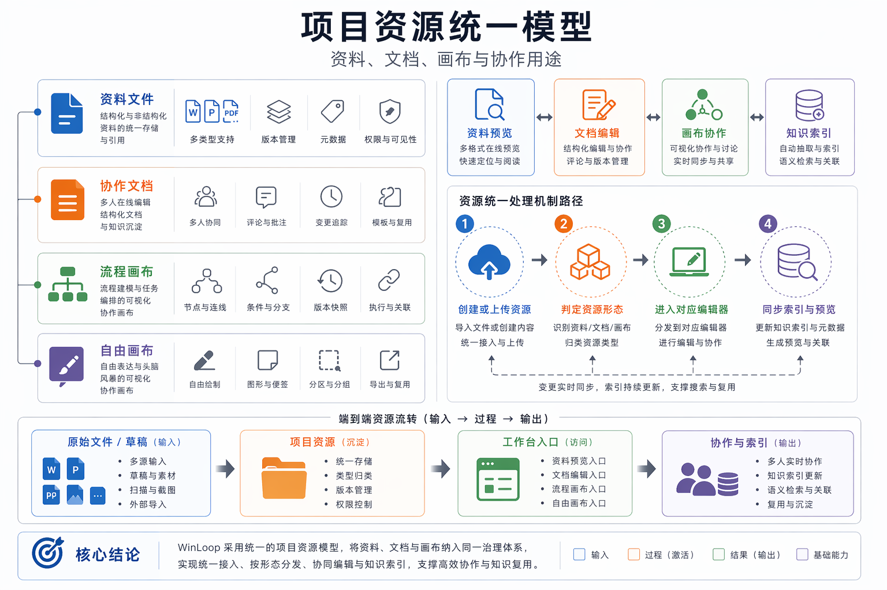

PPT 版：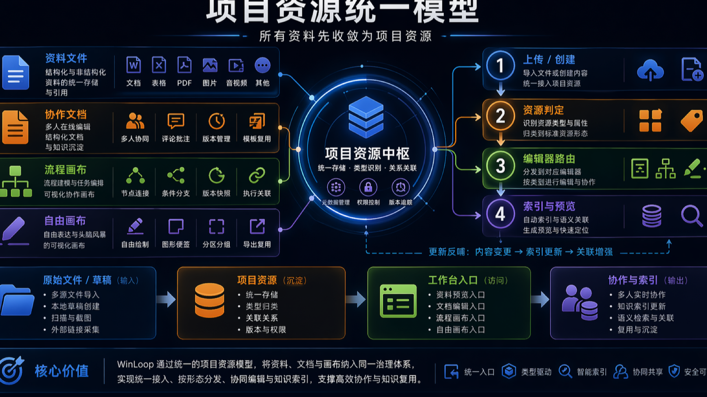

这一设计带来三个好处。第一，上传资料、协作文档、流程画布和自由画布拥有统一的权限、评论、分享和检索接口。第二，后续知识索引和 AI 上下文构建不需要分别兼容多套对象模型。第三，协作与智能能力都能围绕项目对象持续积累，而不是每次从零开始。

## 4. 场景化 AI 运行时

系统中的 AI 并不是一组散落在页面上的模型调用，而是通过统一 channel 路由的场景化运行时。`workspace_chat`、`project_knowledge`、`knowledge_embedding`、`knowledge_visual_embedding`、`defense_realtime`、`meeting_summary`、`workflow_agent` 等不同场景，都拥有不同的输入类型、能力要求和治理边界。

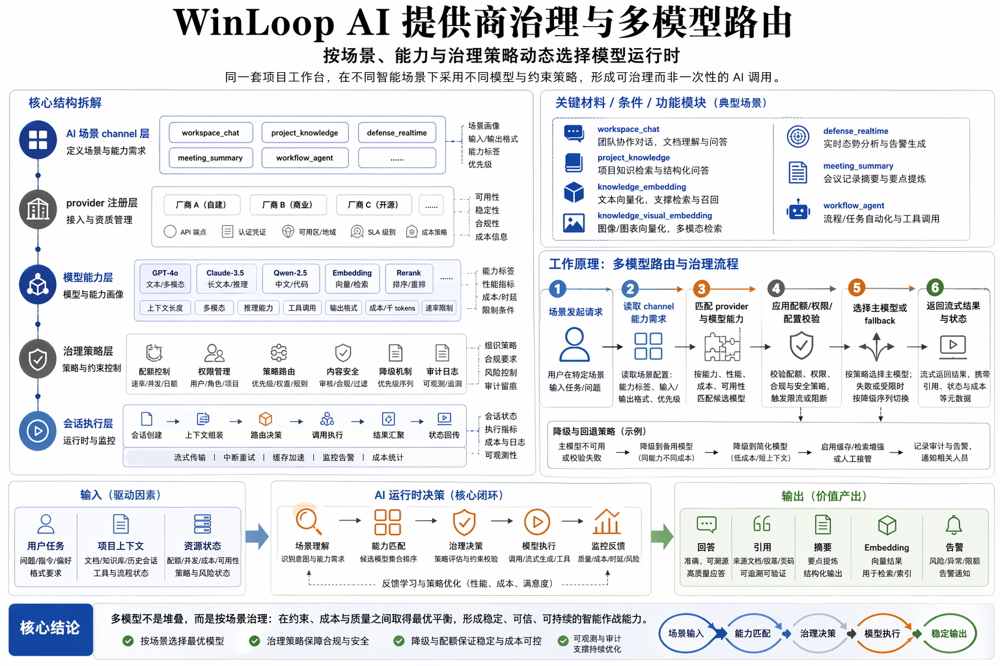

PPT 版：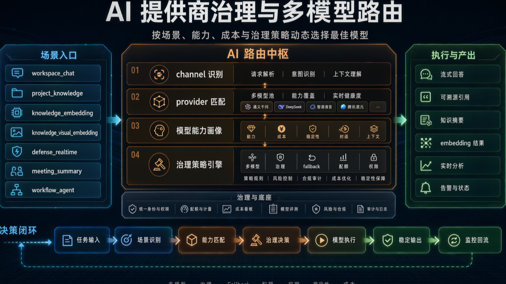

平台会依据 channel、provider、模型能力画像、配额、权限与健康状态完成运行时选择。这种设计使系统具备以下能力：

- 让多模型协同成为工程设计，而不是临时拼接。
- 让未配置、fallback、degraded、writeBlocked 等状态可见化。
- 让不同团队按场景单独治理成本与稳定性。

这意味着 WinLoop 的 AI 设计目标不是“统一聊天体验”，而是“统一治理下的多场景智能执行”。

## 5. 可信知识增强与证据链回流

WinLoop 的项目知识链路强调可追溯性而非单纯召回量。系统把 `ProjectResource` 作为知识入口真相源，把索引 source、task 与 chunk 作为状态真相源，先构建项目知识上下文，再驱动回答生成。

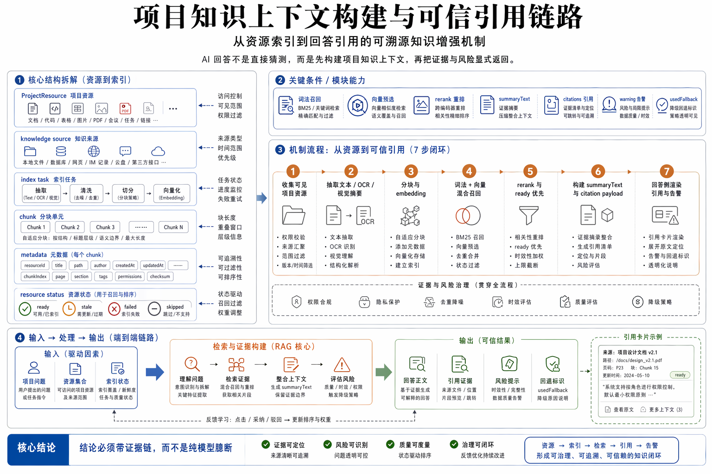

PPT 版：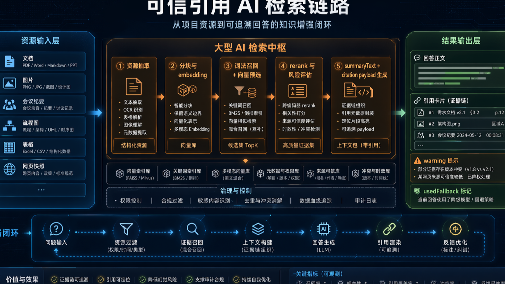

当前链路包括：

- 资源可见性过滤与可用状态判断。
- 文本抽取、OCR、视觉摘要和统一文本投影。
- 分块、embedding、词法召回、向量预选和 rerank。
- `summaryText`、`citations`、`warning` 与 `usedFallback` 的结构化返回。
- 前端对 citation 卡片和 warning 状态的显式渲染。

这一方案在比赛语境下有两个价值。第一，降低 AI 幻觉风险。第二，让项目表达能力与资料沉淀能力真正连在一起。

## 6. DeepAgent 与长任务执行

竞赛项目中的智能任务往往不是一次性完成，例如流程设计、材料整理、长文本总结、会议归档和写操作提案。WinLoop 使用 `contextSnapshot`、`runState`、thread binding、store item 和 checkpoint 构建可恢复执行链路。

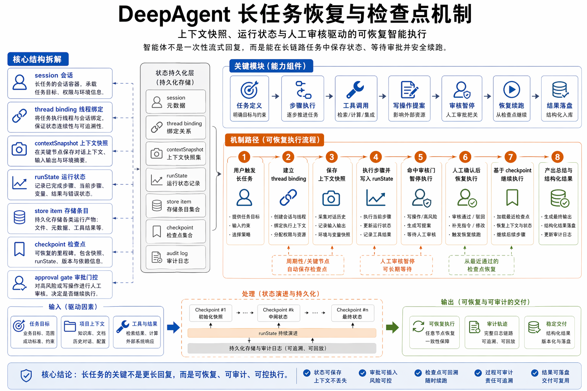

PPT 版：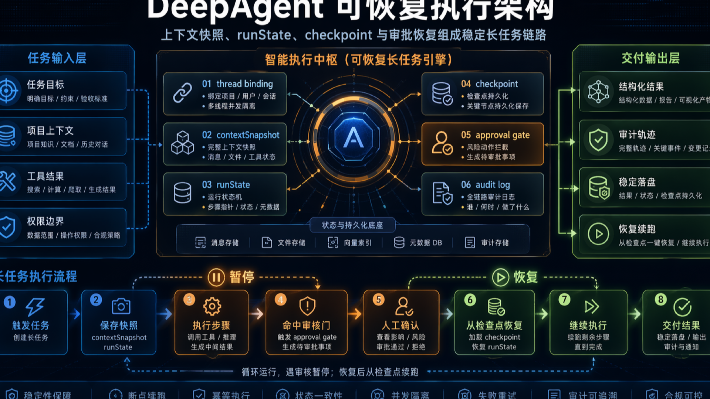

当任务命中需要审核的写操作时，流程会进入暂停态，待用户确认后再恢复，而不是强行落盘。这一机制体现了两个工程判断：

- 写链路必须可控，不能把模型输出当作最终事实。
- 智能任务必须可审计，不能因为刷新或中断就丢失上下文。

## 7. 多模态统一语义空间

WinLoop 并没有为每一种资料模态单独建设一套孤立智能系统，而是采取“文本投影优先”的路线。图片、OCR、流程图快照、网页抓取、会议转写都被归一到统一文本语义表示，再进入同一 embedding 空间。

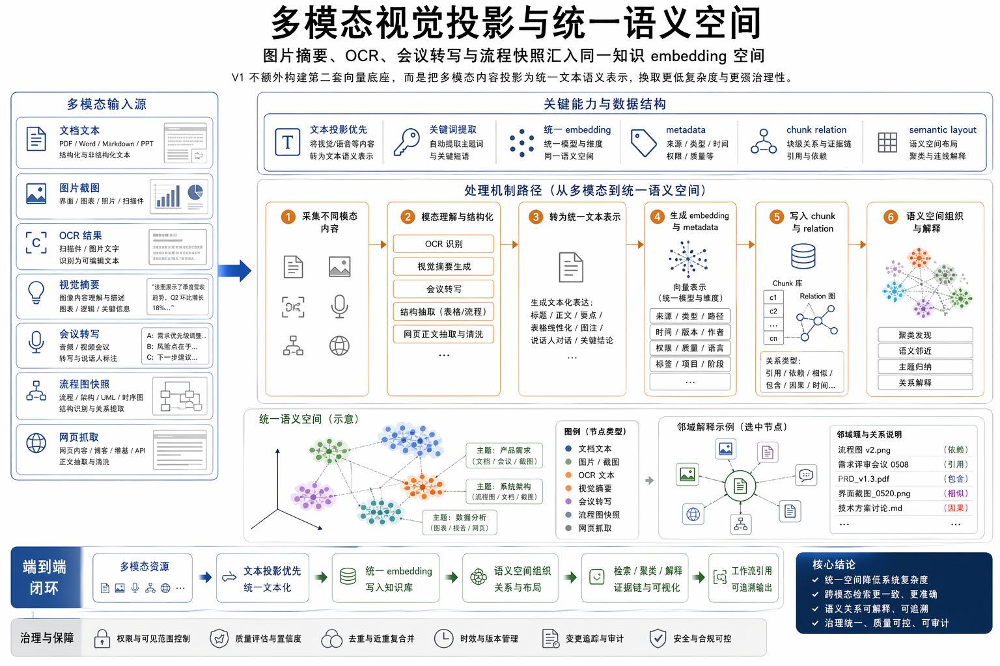

PPT 版：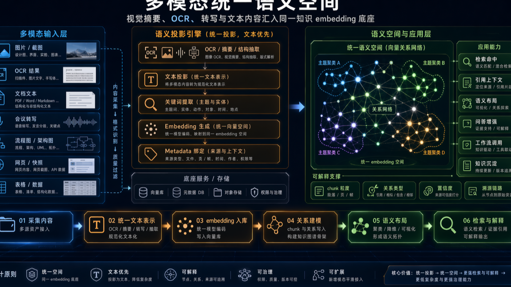

Loopy Data 负责把知识健康、关系网络、语义布局和工作流入口展示为可理解的数据工作台。这样，平台就不仅能回答问题，还能展示知识结构、关系演化与系统健康状态。

## 8. 实时答辩智能体

竞赛答辩是 WinLoop 最具场景特征的能力之一。系统保留 LiveKit 作为会议 RTC 真壳，ASR 负责实时转写，Qwen/Coze realtime 负责推理，turn 管理和摘要结果再回流到答辩工作台。

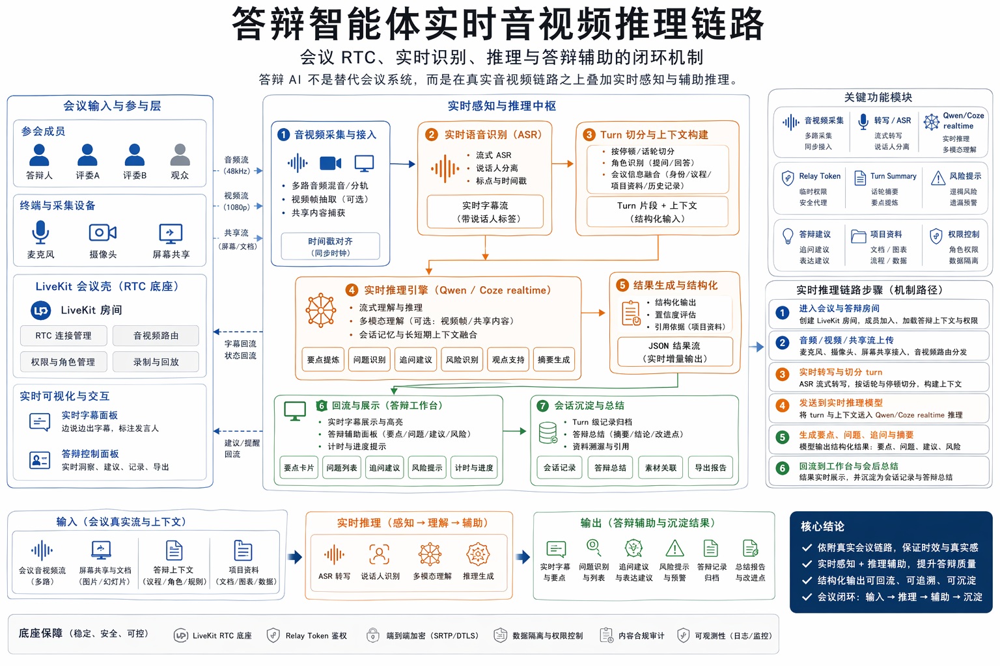

PPT 版：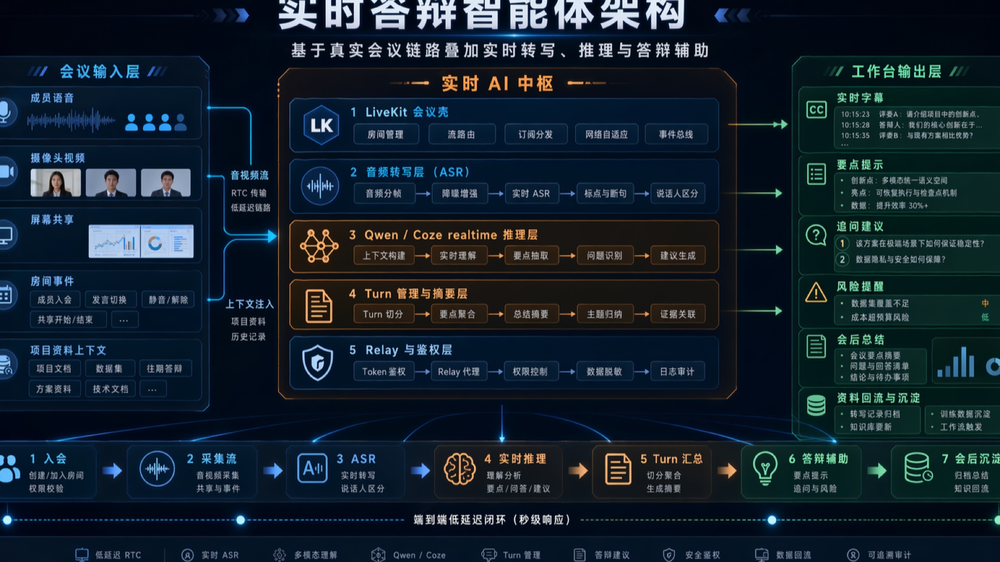

这一路线的关键不在于“模型能听懂语音”，而在于：

- 会议链路是真实存在的，而不是假造的模拟播放。
- 模型推理嵌入实时房间上下文，而不是独立悬空运行。
- 会后产物可以回写为项目资料，成为后续知识的一部分。

这让答辩智能体成为闭环链路中的一环，而不是一次性的展示彩蛋。

## 9. 上下文感知助手

WinLoop 右侧助手之所以有价值，不是因为它叫助手，而是因为它是工作台级上下文执行器。它会根据当前 tab 和工作区模式，动态组装页面状态、资源集合、知识上下文、场景 prompt 和输出协议。

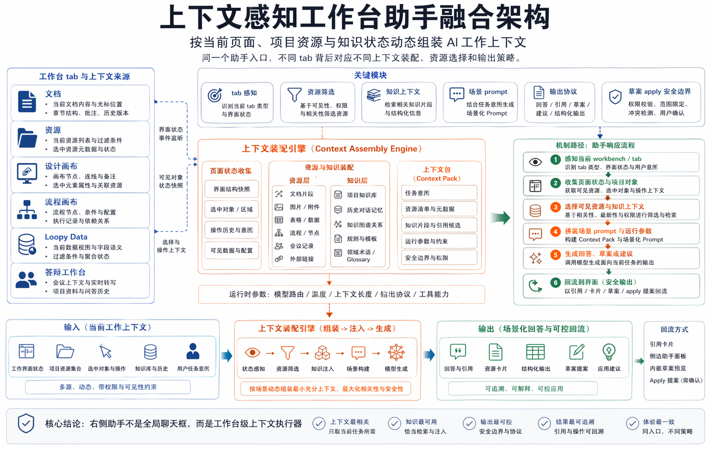

PPT 版：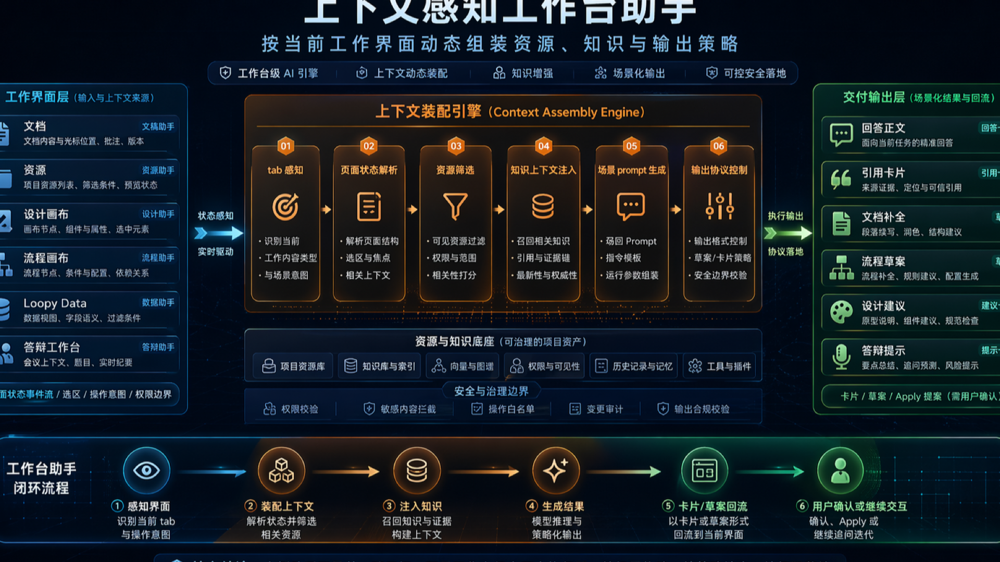

在文档场景下，它更像文稿助手；在设计画布场景下，它更像结构助手；在答辩工作台中，它则承担实时辅助与总结角色。它输出的也不只有回答，还包括引用卡片、流程草案、设计建议和待确认的 apply 提案。

## 10. 运行底座与可观测治理

平台级 AI 的工程成熟度，最终体现在可观测性和治理能力上。WinLoop 当前运行于 PostgreSQL、Redis、对象存储、Worker、资源处理链、知识索引链和 AI Runtime 之上，并通过 Sentry、后台探针和诊断页进行治理。

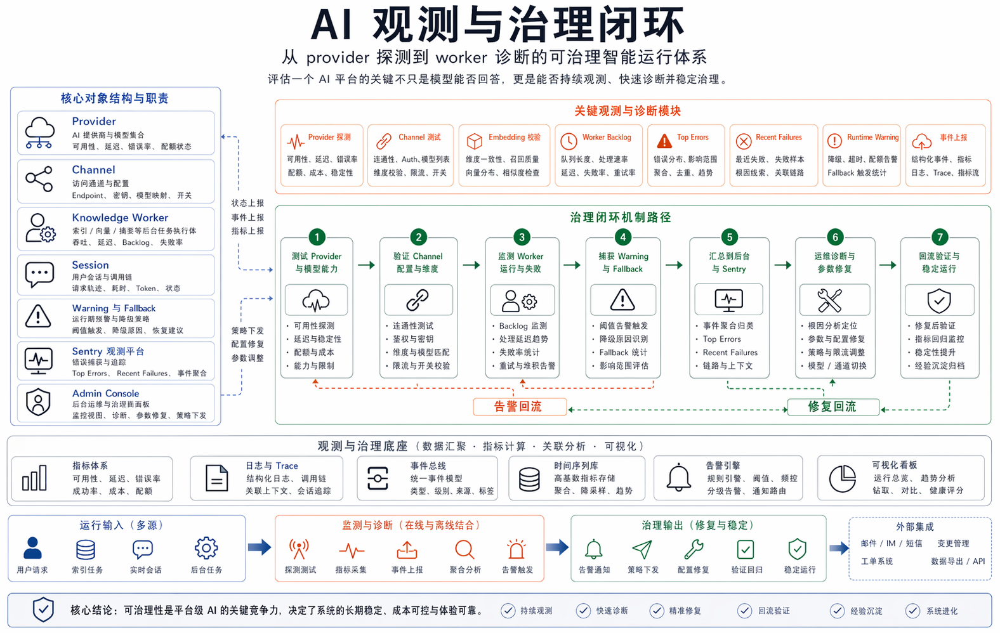

PPT 版：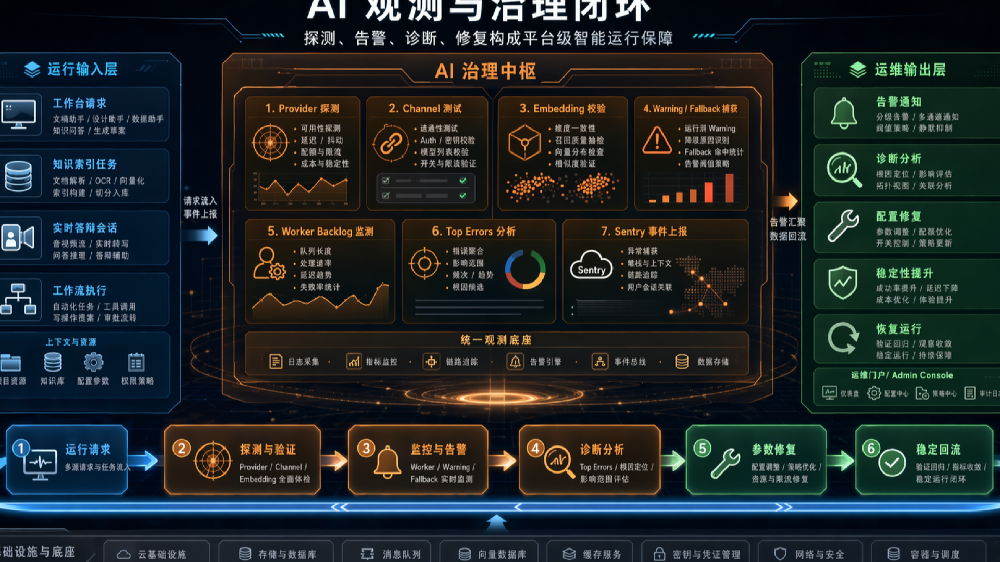

这套治理体系至少覆盖了以下维度：

- provider 探测与 channel 测试。
- embedding 维度和配置合法性检查。
- knowledge worker backlog、recent failures 和 top errors 监控。
- warning、fallback 与运行时异常的结构化暴露。
- Sentry 事件上报与后台修复入口。

对评委而言，这一层说明 WinLoop 不是“能演示的 AI”，而是“可运行的智能平台”。

## 11. 技术壁垒与差异化判断

从评审视角看，WinLoop 的技术壁垒主要体现在五点：

- 有稳定对象模型，而不是临时把数据塞进 prompt。
- 有场景化运行时，而不是把所有能力压在一个模型上。
- 有可信引用和 warning 机制，而不是纯自然语言输出。
- 有可恢复执行与人工审核门，而不是一次性生成。
- 有实时答辩链路和 AI 运维治理，而不是只做静态文档生成。

这五点共同决定了项目的差异化方向：不是做通用 AI 助手，而是做竞赛团队的智能作战系统。

## 12. 当前边界与后续演进

为了保持系统可落地，当前版本也保留了明确边界。例如，多模态仍以文本投影优先，不追求首期图搜图上限；citation 已可显式返回，但页码级精准定位仍可继续强化；实时答辩链路已经具备真实结构，但更强的字幕质量、多人多角色策略与后验校验仍可进一步演进。

这说明系统的选择是克制而非保守。我们优先构建统一底座和可治理结构，再在此基础上逐步扩展能力深度。

## 13. 结论

WinLoop 的价值不在于又做了一个竞赛平台，也不在于简单接入了几个模型，而在于它把竞赛团队最核心的工作对象、资料沉淀方式、智能执行方式和答辩表达方式重构为同一平台。这个平台既能服务项目推进，也能形成技术表达，更能在 AI 技术评审里清晰回答“为什么可信、为什么可控、为什么能跑”这三个关键问题。
